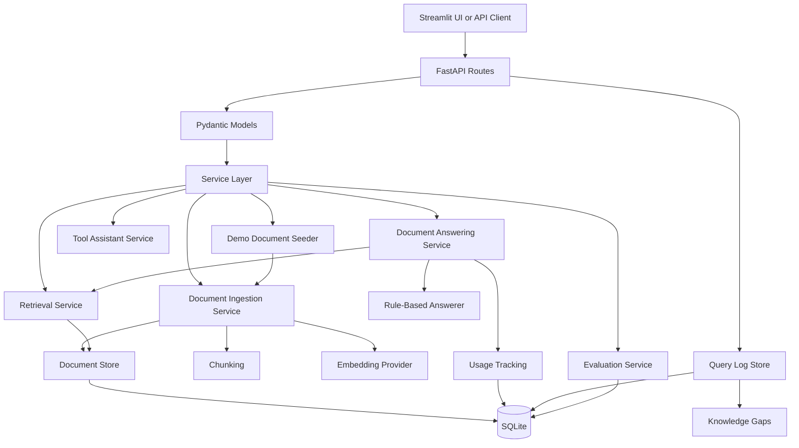

# Business RAG Knowledge-Base Chatbot

A local-first FastAPI and Streamlit application for asking grounded questions over business documents.

The project supports document upload, automatic demo-data seeding, text/Markdown/PDF ingestion, local embeddings, hybrid retrieval, grounded document Q&A with citations, explicit fallback behavior, query logging, knowledge-gap tracking, usage tracking, evaluation runs, and a practical Streamlit interface.

It is built as a portfolio-oriented AI engineering project: the code favors clear service boundaries, testability, and inspectable RAG behavior over framework-heavy abstraction.

---

## Table of Contents

- [What This Project Demonstrates](#what-this-project-demonstrates)
- [Core Features](#core-features)
- [Architecture Overview](#architecture-overview)
- [Project Structure](#project-structure)
- [Requirements](#requirements)
- [Quick Start](#quick-start)
- [Configuration](#configuration)
- [Running the Streamlit UI](#running-the-streamlit-ui)
- [Running with Docker](#running-with-docker)
- [API Authentication](#api-authentication)
- [Demo Data](#demo-data)
- [Document Layers](#document-layers)
- [API Reference](#api-reference)
- [Document Q&A Workflow](#document-qa-workflow)
- [Admin and Debug Workflow](#admin-and-debug-workflow)
- [Tool Assistant Workflow](#tool-assistant-workflow)
- [Evaluation](#evaluation)
- [Usage and Cost Tracking](#usage-and-cost-tracking)
- [Testing](#testing)
- [Persistence](#persistence)
- [Operational Notes](#operational-notes)
- [Known Limitations](#known-limitations)
- [Suggested Roadmap](#suggested-roadmap)
- [Development Philosophy](#development-philosophy)

---

## What This Project Demonstrates

This project demonstrates practical backend and product patterns used in real AI applications:

- FastAPI route design with Pydantic request and response models
- Streamlit app for local demo and admin workflows
- API-key protected document and admin endpoints
- structured extraction from text
- classification and summarization endpoints
- local deterministic substitutes for model behavior during development
- document upload for `.txt`, `.md`, and `.pdf`
- PDF text extraction with page-aware metadata
- document chunking
- local embedding generation with `sentence-transformers`
- hybrid vector and keyword retrieval
- grounded document answers with source citations
- fallback behavior when retrieved context does not support an answer
- background ingestion jobs
- demo-data seeding
- protected non-deletable demo documents
- temporary user-uploaded documents
- document listing, deletion, and re-indexing
- admin query logs with retrieved-source debug data
- knowledge-gap reporting from fallback questions
- document Q&A evaluation with answerable and unanswerable cases
- usage and estimated cost tracking
- SQLite-backed persistence
- request logging, request IDs, health checks, and Docker packaging

---

## Core Features

### Streamlit UI

The local Streamlit app provides:

- a top-of-page chat form
- clearly identified latest chatbot answer
- expandable citation/source cards
- suggested demo questions with `Ask` buttons
- previous conversation history
- safety notice for demo usage
- document-source management split into two layers
- upload panel for temporary documents
- re-index controls
- delete controls for temporary documents
- protected demo documents with no delete button
- recent query logs with retrieved sources and latency

### Document Q&A

The document Q&A system can:

- upload `.txt`, `.md`, and `.pdf` documents
- seed fictional demo documents automatically
- process documents into chunks
- generate embeddings with `sentence-transformers/all-MiniLM-L6-v2`
- store chunks and metadata in SQLite
- retrieve relevant chunks using hybrid scoring
- answer from retrieved context only
- return fallback when context is missing or weak
- cite filename, page number, snippet, and retrieval scores
- ask across the full knowledge base when `document_id` is omitted
- ask against one document when `document_id` is provided

### Admin and Debug

The admin/debug functionality includes:

- list indexed documents
- distinguish demo and temporary uploaded documents
- delete temporary uploaded documents
- block deletion of demo documents
- re-index documents
- inspect ingestion job status
- view document query logs
- inspect retrieved chunks for logged queries
- track fallback questions as knowledge gaps
- review latency, citation count, and fallback status

### Other AI Application Patterns

The repository also includes smaller endpoints for:

- structured extraction
- classification
- summarization
- context-only answer generation
- request routing
- a simple tool assistant for order/refund workflows

---

## Architecture Overview

```text
Streamlit UI / API clients
  ↓
FastAPI routes
  ↓
Pydantic request/response models
  ↓
Service layer
  ↓
Providers, tools, stores, and clients
  ↓
SQLite / local embeddings / local or HTTP tool clients
```



Key design choices:

1. **Routes stay thin.**  
   FastAPI route handlers validate input, call services, translate application errors into HTTP errors, and return response models.

2. **Services contain application behavior.**  
   Extraction, classification, summarization, answering, ingestion, retrieval, tool use, evaluation, query logging, and usage tracking are separated into service modules.

3. **Local components keep development testable.**  
   The current system uses deterministic or local implementations for many model-like behaviors. This keeps tests predictable and avoids requiring paid model APIs during development.

4. **Document Q&A is grounded.**  
   Answers are generated only from retrieved document chunks. The API returns citations with source metadata and relevance scores.

5. **Fallback is explicit.**  
   Fallback is represented as `was_fallback`, not inferred from citation count.

6. **Demo data is separated from temporary uploads.**  
   Demo documents are loaded from `demo/`, marked with `is_demo=True`, and protected from deletion.

---

## Project Structure

```text
.
├── main.py                              # FastAPI app, route definitions, dependencies, lifespan seeding
├── auth.py                              # API key dependency
├── settings.py                          # Environment-based settings
├── Dockerfile                           # Backend container image definition
├── requirements.txt                     # Python dependencies
├── frontend/
│   └── app.py                           # Streamlit local UI
├── demo/                                # Safe fictional demo documents seeded on startup
├── models/                              # Pydantic request/response models
├── services/                            # Application services and persistence
├── providers/                           # Embedding/model provider abstractions
├── clients/                             # External/local order API clients
├── tools/                               # Tool functions used by the assistant
├── evals/                               # Evaluation case definitions
├── scripts/                             # Evaluation runners
└── tests/                               # API, unit, and client tests
```

Important files:

| File | Purpose |
|---|---|
| `main.py` | FastAPI app, middleware, dependencies, HTTP routes, and startup demo seeding. |
| `frontend/app.py` | Streamlit UI for chat, document layers, upload, citations, and query logs. |
| `auth.py` | Enforces `X-API-Key` authentication for protected endpoints. |
| `models/document_qa.py` | Document upload, Q&A, citation, query-log, and knowledge-gap response models. |
| `models/evaluation.py` | Document Q&A evaluation case and result models. |
| `services/demo_document_seeder.py` | Loads files from `demo/` into the document store as protected demo documents. |
| `services/pdf_parser.py` | Extracts readable text and page numbers from PDFs. |
| `services/document_ingestion_service.py` | Chunks documents, embeds chunks, stores documents, and records usage. |
| `services/document_ingestion_worker.py` | Manages ingestion job status transitions. |
| `services/ingestion_queue.py` | Defines ingestion queue protocol and FastAPI background-task implementation. |
| `services/retrieval_service.py` | Performs hybrid vector and keyword retrieval. |
| `services/document_answering_service.py` | Retrieves chunks, answers questions, and returns citations. |
| `services/rule_based_answerer.py` | Local context-only answerer with fallback behavior. |
| `services/sqlite_document_store.py` | Persists documents, chunks, embeddings, metadata, and demo flags. |
| `services/document_query_log_store.py` | Persists document questions, answers, fallback status, and retrieved-source debug data. |
| `services/evaluation_result_store.py` | Persists document Q&A evaluation summaries and case results. |
| `services/usage_tracking_service.py` | Records estimated token usage and estimated cost. |
| `services/tool_assistant_service.py` | Implements order-status and refund-assistant workflow logic. |

---

## Requirements

- Python 3.12 recommended
- FastAPI
- Uvicorn
- Pydantic
- python-multipart
- pypdf
- sentence-transformers
- Streamlit
- requests
- python-dotenv
- pytest
- httpx

The application uses `sentence-transformers/all-MiniLM-L6-v2` by default for local document embeddings. The first run may download the model.

---

## Quick Start

### 1. Clone the repository

```bash
git clone https://github.com/GiacomoMariani/llm-extractor.git
cd llm-extractor
```

### 2. Create and activate a virtual environment

```bash
python -m venv .venv
source .venv/bin/activate
```

On Windows PowerShell:

```powershell
python -m venv .venv
.\.venv\Scripts\Activate.ps1
```

### 3. Install dependencies

```bash
pip install --upgrade pip
pip install -r requirements.txt
```

### 4. Create local environment configuration

Copy the example file:

```bash
cp .env.example .env
```

On Windows PowerShell:

```powershell
Copy-Item .env.example .env
```

At minimum, set:

```env
APP_API_KEY=dev-secret-key
API_BASE_URL=http://localhost:8000
```

`APP_API_KEY` is used by the backend and Streamlit UI. `API_BASE_URL` tells Streamlit where the FastAPI backend is running.

### 5. Run the backend

```bash
uvicorn main:app --reload
```

The API will be available at:

```text
http://127.0.0.1:8000
```

Interactive API docs:

```text
http://127.0.0.1:8000/docs
```

Health check:

```bash
curl http://127.0.0.1:8000/health
```

Expected response:

```json
{
  "status": "ok"
}
```

### 6. Run the Streamlit UI in a second terminal

```bash
streamlit run frontend/app.py
```

Streamlit usually opens at:

```text
http://localhost:8501
```

Keep both processes running:

```text
Terminal 1: uvicorn main:app --reload
Terminal 2: streamlit run frontend/app.py
```

---

## Configuration

Environment variables:

| Variable | Default | Purpose |
|---|---:|---|
| `APP_API_KEY` | none | Required for protected endpoints. Requests must send this value in `X-API-Key`. The Streamlit UI reads the same value from `.env`. |
| `API_BASE_URL` | `http://localhost:8000` in Streamlit | Backend URL used by `frontend/app.py`. |
| `APP_DB_PATH` | `app.db` | SQLite database path for documents, chunks, ingestion jobs, query logs, evaluations, and usage records. |
| `APP_UPLOADED_TEXT_DB_PATH` | `uploaded_texts.db` | SQLite database path for staged uploaded text. |
| `APP_UPLOADED_TEXT_CLEANUP_MAX_AGE_HOURS` | `24` | Maximum age for uploaded text cleanup. |
| `EXTRACTOR_TYPE` | `rule` | Extraction backend. Supported values include local/mock implementations. |
| `ORDER_CLIENT_TYPE` | `local` | Order client backend. Supported values include `local`, `http`, and `http_with_fallback`. |
| `ORDER_API_BASE_URL` | none | Required when using an HTTP order client. |
| `ORDER_API_KEY` | none | Optional bearer token for the external order API client. |

Example `.env` for local development:

```env
APP_API_KEY=dev-secret-key
API_BASE_URL=http://localhost:8000
APP_DB_PATH=app.db
APP_UPLOADED_TEXT_DB_PATH=uploaded_texts.db
EXTRACTOR_TYPE=rule
ORDER_CLIENT_TYPE=local
```

---

## Running the Streamlit UI

Run the backend first:

```bash
uvicorn main:app --reload
```

Then run Streamlit:

```bash
streamlit run frontend/app.py
```

The Streamlit page includes:

1. **Chat with the knowledge base**  
   Ask questions across both document layers. The latest answer appears directly under the question box.

2. **Suggested demo questions**  
   Ten sample questions are available with nearby `Ask` buttons.

3. **Document sources**  
   Documents are split into two layers:
   - Layer 1: preloaded demo knowledge base
   - Layer 2: temporary user uploads

4. **Recent query logs**  
   Shows answer/fallback status, citation count, latency, and retrieved sources.

The UI includes a demo safety notice:

```text
Demo environment: this page is for testing only. Do not upload confidential, personal, financial, legal, or sensitive business data.
```

---

## Running with Docker

The Dockerfile currently runs the FastAPI backend.

### Build the image

```bash
docker build -t llm-extractor .
```

### Run the backend container

```bash
docker run --rm \
  -p 8000:8000 \
  -e APP_API_KEY="dev-secret-key" \
  -e APP_DB_PATH="/app/data/app.db" \
  -e APP_UPLOADED_TEXT_DB_PATH="/app/data/uploaded_texts.db" \
  -v "$(pwd)/data:/app/data" \
  llm-extractor
```

Health check:

```bash
curl http://127.0.0.1:8000/health
```

Notes:

- The Dockerfile exposes port `8000`.
- The container includes a health check against `/health`.
- Mounting `/app/data` keeps SQLite files outside the disposable container filesystem.
- Streamlit is intended for local development in the current setup. It can be containerized later if needed.

---

## API Authentication

Protected endpoints require this header:

```http
X-API-Key: dev-secret-key
```

If `APP_API_KEY` is missing on the server, protected routes return `500` because the server is misconfigured.

If the request omits or sends the wrong key, protected routes return `401`.

---

## Demo Data

The `demo/` folder contains fictional, safe demo documents. They are designed to make the app usable immediately without uploading real business data.

Current demo files include:

```text
demo/
├── business_rag_chat_presentation.pdf
├── demo_company_policy.txt
├── demo_customer_support_faq.pdf
├── demo_orders_invoices.txt
├── demo_pricing_and_service_packages.txt
└── demo_team_directory.txt
```

On backend startup, `DemoDocumentSeeder` reads this folder and ingests supported files.

Supported seeded file types:

- `.txt`
- `.md`
- `.pdf`

Seeded demo documents are marked with:

```json
{
  "is_demo": true
}
```

Demo documents are protected from deletion. If a client tries to delete one, the API returns `403`.

---

## Document Layers

The app intentionally separates documents into two layers.

### Layer 1: Preloaded demo knowledge base

These are fictional documents bundled with the project. They are loaded from the `demo/` folder on backend startup and are always available for testing.

Properties:

- seeded automatically
- marked with `is_demo=true`
- visible in the Streamlit document section
- can be re-indexed
- cannot be deleted

### Layer 2: Temporary user uploads

These are files uploaded during local testing from the Streamlit UI or API.

Properties:

- uploaded manually
- marked with `is_demo=false`
- visible separately from demo documents
- can be re-indexed
- can be deleted

This split keeps the demo environment stable while still allowing upload/delete testing.

---

## API Reference

### Health

```bash
curl http://127.0.0.1:8000/health
```

### Structured extraction

```bash
curl -X POST http://127.0.0.1:8000/extract \
  -H "Content-Type: application/json" \
  -H "X-API-Key: dev-secret-key" \
  -d '{
    "text": "Customer Jane Doe reports a billing question with order ORD-123."
  }'
```

### Classification

```bash
curl -X POST http://127.0.0.1:8000/classify \
  -H "Content-Type: application/json" \
  -d '{
    "text": "I need help understanding my subscription invoice."
  }'
```

### Summarization

```bash
curl -X POST http://127.0.0.1:8000/summarize \
  -H "Content-Type: application/json" \
  -d '{
    "text": "The customer contacted support about a delivery question and requested a status update."
  }'
```

### Context answer

```bash
curl -X POST http://127.0.0.1:8000/answer \
  -H "Content-Type: application/json" \
  -H "X-API-Key: dev-secret-key" \
  -d '{
    "question": "What did the customer request?",
    "context": "The customer contacted support about a delivery question and requested a status update."
  }'
```

Response shape:

```json
{
  "answer": "The customer requested a status update.",
  "was_fallback": false
}
```

### Upload a document

Supported file types:

- `.txt`
- `.md`
- `.pdf`

```bash
curl -X POST http://127.0.0.1:8000/documents/upload \
  -H "X-API-Key: dev-secret-key" \
  -F "file=@docs/company-handbook.pdf"
```

Response shape:

```json
{
  "job_id": "job-abc123def456",
  "filename": "company-handbook.pdf",
  "status": "queued",
  "document_id": null,
  "chunk_count": null,
  "error_message": null,
  "created_at": "2026-05-05T08:00:00+00:00",
  "updated_at": "2026-05-05T08:00:00+00:00"
}
```

### Check ingestion job status

```bash
curl http://127.0.0.1:8000/documents/jobs/job-abc123def456 \
  -H "X-API-Key: dev-secret-key"
```

Possible statuses:

- `queued`
- `processing`
- `completed`
- `failed`

Response shape:

```json
{
  "job_id": "job-abc123def456",
  "filename": "company-handbook.pdf",
  "status": "completed",
  "document_id": "doc-abc123def456",
  "chunk_count": 8,
  "error_message": null,
  "created_at": "2026-05-05T08:00:00+00:00",
  "updated_at": "2026-05-05T08:00:02+00:00"
}
```

### List documents

```bash
curl http://127.0.0.1:8000/documents \
  -H "X-API-Key: dev-secret-key"
```

Response shape:

```json
{
  "documents": [
    {
      "document_id": "doc-abc123def456",
      "filename": "company-handbook.pdf",
      "file_type": "pdf",
      "upload_date": "2026-05-05T08:00:02+00:00",
      "status": "indexed",
      "page_count": 12,
      "chunk_count": 8,
      "is_demo": false
    }
  ]
}
```

### Ask across all indexed documents

Omit `document_id` to ask the full knowledge base.

```bash
curl -X POST http://127.0.0.1:8000/documents/ask \
  -H "Content-Type: application/json" \
  -H "X-API-Key: dev-secret-key" \
  -d '{
    "question": "Which customer orders are ready to ship?",
    "top_k": 3
  }'
```

### Ask a specific document

Pass `document_id` to restrict retrieval to one document.

```bash
curl -X POST http://127.0.0.1:8000/documents/ask \
  -H "Content-Type: application/json" \
  -H "X-API-Key: dev-secret-key" \
  -d '{
    "document_id": "doc-abc123def456",
    "question": "What is the vacation policy?",
    "top_k": 3
  }'
```

Response shape:

```json
{
  "answer": "Employees may work remotely up to two days per week.",
  "citations": [
    {
      "chunk_id": "doc-abc123def456-chunk-2",
      "filename": "demo_company_policy.txt",
      "page_number": null,
      "snippet": "Employees may work remotely up to two days per week.",
      "vector_score": 0.82,
      "keyword_score": 1.0,
      "hybrid_score": 0.91
    }
  ],
  "was_fallback": false
}
```

Fallback response shape:

```json
{
  "answer": "I could not find the answer in the provided context.",
  "citations": [],
  "was_fallback": true
}
```

### Re-index a document

```bash
curl -X POST http://127.0.0.1:8000/documents/doc-abc123def456/reindex \
  -H "X-API-Key: dev-secret-key"
```

Response shape:

```json
{
  "job_id": "job-def456abc123",
  "document_id": "doc-abc123def456",
  "filename": "company-handbook.pdf",
  "status": "queued"
}
```

### Delete a temporary document

```bash
curl -X DELETE http://127.0.0.1:8000/documents/doc-abc123def456 \
  -H "X-API-Key: dev-secret-key"
```

Response shape:

```json
{
  "document_id": "doc-abc123def456",
  "deleted": true
}
```

Trying to delete a demo document returns:

```json
{
  "detail": "Demo documents cannot be deleted."
}
```

with HTTP status `403`.

### View document query logs

```bash
curl "http://127.0.0.1:8000/admin/document-query-logs?limit=10" \
  -H "X-API-Key: dev-secret-key"
```

Response shape:

```json
{
  "logs": [
    {
      "query_id": "query-abc123def456",
      "document_id": "all-documents",
      "question": "Which package includes monthly reporting?",
      "answer": "The Growth package includes monthly reporting.",
      "citation_count": 1,
      "latency_ms": 18.5,
      "was_fallback": false,
      "created_at": "2026-05-05T08:05:00+00:00",
      "retrieved_sources": [
        {
          "source_id": "source-abc123def456",
          "query_id": "query-abc123def456",
          "chunk_id": "doc-abc123def456-chunk-2",
          "filename": "demo_pricing_and_service_packages.txt",
          "snippet": "The Growth package includes monthly reporting.",
          "page_number": null,
          "vector_score": 0.82,
          "keyword_score": 1.0,
          "hybrid_score": 0.91
        }
      ]
    }
  ]
}
```

### View knowledge gaps

Knowledge gaps are fallback document questions. They help identify missing information in the indexed documents.

```bash
curl "http://127.0.0.1:8000/admin/knowledge-gaps?limit=10" \
  -H "X-API-Key: dev-secret-key"
```

### Latest document Q&A evaluation run

```bash
curl http://127.0.0.1:8000/evals/document-qa/latest \
  -H "X-API-Key: dev-secret-key"
```

### Usage summary

```bash
curl http://127.0.0.1:8000/usage/summary \
  -H "X-API-Key: dev-secret-key"
```

### Recent usage records

```bash
curl "http://127.0.0.1:8000/usage/recent?limit=10" \
  -H "X-API-Key: dev-secret-key"
```

---

## Document Q&A Workflow

Typical flow:

1. Backend starts.
2. Demo documents from `demo/` are seeded if they are not already present.
3. User uploads a temporary `.txt`, `.md`, or `.pdf` file through Streamlit or `POST /documents/upload`.
4. The API stores uploaded text in a staging table.
5. The API creates an ingestion job.
6. A background task processes the document.
7. The ingestion service chunks the document.
8. The embedding provider generates one embedding per chunk.
9. The document store persists:
   - document metadata
   - demo flag
   - original extracted text
   - chunk text
   - chunk embeddings
   - page numbers when available
10. The user asks a question through Streamlit or `POST /documents/ask`.
11. The retrieval service retrieves top candidate chunks.
12. The answerer returns either:
    - a grounded answer with citations, or
    - a fallback response if the context does not support an answer.
13. The API logs the question, answer, latency, citation count, fallback status, and retrieved sources.

---

## Admin and Debug Workflow

Useful admin calls:

```bash
curl http://127.0.0.1:8000/documents \
  -H "X-API-Key: dev-secret-key"
```

```bash
curl "http://127.0.0.1:8000/admin/document-query-logs?limit=20" \
  -H "X-API-Key: dev-secret-key"
```

```bash
curl "http://127.0.0.1:8000/admin/knowledge-gaps?limit=20" \
  -H "X-API-Key: dev-secret-key"
```

The Streamlit page exposes the most important admin/debug data directly:

- document library
- demo vs temporary document split
- document actions
- query logs
- retrieved sources
- latency
- fallback status

---

## Tool Assistant Workflow

The tool assistant demonstrates a separate AI product pattern: assistant-controlled tool use with confirmation before side effects.

### Ask about order status

```bash
curl -X POST http://127.0.0.1:8000/tool-assistant \
  -H "Content-Type: application/json" \
  -H "X-API-Key: dev-secret-key" \
  -d '{
    "message": "Where is order ORD-123?"
  }'
```

### Ask about refund eligibility

```bash
curl -X POST http://127.0.0.1:8000/tool-assistant \
  -H "Content-Type: application/json" \
  -H "X-API-Key: dev-secret-key" \
  -d '{
    "message": "Can I get a refund for ORD-789?"
  }'
```

### Create a pending refund request

```bash
curl -X POST http://127.0.0.1:8000/tool-assistant \
  -H "Content-Type: application/json" \
  -H "X-API-Key: dev-secret-key" \
  -d '{
    "message": "I want to request a refund for ORD-123."
  }'
```

### Confirm a pending action

```bash
curl -X POST http://127.0.0.1:8000/tool-assistant \
  -H "Content-Type: application/json" \
  -H "X-API-Key: dev-secret-key" \
  -d '{
    "message": "Confirm PEND-001."
  }'
```

This two-step pattern is intentional: the assistant can prepare an action, but the user must explicitly confirm before the side effect is completed.

---

## Evaluation

The repository includes evaluation cases and scripts for two capabilities.

### Extraction evaluation

```bash
python scripts/run_extraction_eval.py
```

This loads cases from:

```text
evals/extraction_cases.json
```

It compares actual structured extraction output against expected JSON.

### Document Q&A evaluation

```bash
python scripts/run_document_qa_eval.py
```

This loads cases from:

```text
evals/document_qa_cases.json
```

The document Q&A evaluation checks:

- answer content
- fallback behavior
- citation count
- citation content
- retrieval score presence
- latency per case

The current document Q&A eval set includes 10 cases, with both answerable and unanswerable/fallback questions.

The latest evaluation run is stored in SQLite and can be inspected through:

```bash
curl http://127.0.0.1:8000/evals/document-qa/latest \
  -H "X-API-Key: dev-secret-key"
```

---

## Usage and Cost Tracking

The app records usage for document embedding and document answering operations.

Usage records include:

- operation name
- provider
- model name
- estimated input tokens
- estimated output tokens
- estimated cost
- metadata
- creation timestamp

The token estimator is intentionally simple: approximately one token per four characters. Default pricing is zero unless a service records usage with explicit pricing.

### Usage summary

```bash
curl http://127.0.0.1:8000/usage/summary \
  -H "X-API-Key: dev-secret-key"
```

### Recent usage records

```bash
curl "http://127.0.0.1:8000/usage/recent?limit=10" \
  -H "X-API-Key: dev-secret-key"
```

---

## Testing

Run the full test suite:

```bash
pytest -q
```

Useful focused test commands:

```bash
pytest tests/api/test_document_routes.py
```

```bash
pytest tests/api/test_usage_routes.py
```

```bash
pytest tests/units/test_document_ingestion_service.py
```

```bash
pytest tests/units/test_document_answering_service.py
```

```bash
pytest tests/units/test_document_query_log_store.py
```

```bash
pytest tests/units/test_document_store_metadata.py
```

```bash
pytest tests/units/test_document_qa_evaluation_service.py
```

The tests cover:

- API routes
- service behavior
- document ingestion
- demo document flags
- protected demo deletion behavior
- PDF parsing
- ingestion queues
- stored text ingestion
- retrieval scoring
- document answering
- all-document Q&A
- explicit fallback behavior
- document query logs
- knowledge gaps
- document metadata
- evaluation result storage
- usage tracking
- tool assistant behavior
- order client fallback and retry behavior

For local app testing, configure:

```bash
export APP_API_KEY="dev-secret-key"
```

On Windows PowerShell:

```powershell
$env:APP_API_KEY="dev-secret-key"
```

The test suite itself sets a test API key through fixtures.

---

## Persistence

The app uses SQLite.

By default, persistent application data is written to:

```text
app.db
```

The upload staging store defaults to:

```text
uploaded_texts.db
```

Tables include data for:

- documents
- chunks
- ingestion jobs
- staged uploaded text
- document query logs
- retrieved source logs
- evaluation runs
- evaluation case results
- usage records

Document rows include the `is_demo` flag so the application can distinguish seeded demo documents from temporary user uploads.

Set `APP_DB_PATH` to control the main application database location:

```bash
export APP_DB_PATH="data/app.db"
```

Set `APP_UPLOADED_TEXT_DB_PATH` to control the upload staging database location:

```bash
export APP_UPLOADED_TEXT_DB_PATH="data/uploaded_texts.db"
```

For Docker, prefer mounting a volume and setting SQLite paths inside that volume.

---

## Operational Notes

### Request logging

Every request is logged with:

- method
- path
- status code
- duration in milliseconds
- request ID

If a request sends `X-Request-ID`, the app reuses it. Otherwise, the middleware creates a short request ID and returns it in the response header.

### Demo seeding

The FastAPI lifespan hook seeds supported documents from `demo/` on startup.

The seeder skips files already present as demo documents by filename. This prevents duplicate demo documents during repeated local restarts.

### Background jobs

Document uploads create ingestion jobs and enqueue work through the `DocumentIngestionQueue` protocol.

The current implementation uses FastAPI `BackgroundTasks`. This is useful for learning and small local deployments, but it is not a durable queue. If the process exits before the background task completes, queued work can be lost.

### Uploaded text staging

Document upload stores raw extracted text in a staging table and queues a pointer to that stored text. This avoids putting large raw text directly into the queue payload.

Completed ingestion deletes the staged text. Failed or abandoned staging records can be cleaned up through the uploaded-text cleanup endpoint.

### Fallback logging

Fallback is stored explicitly as `was_fallback`.

This matters because fallback should not be inferred only from citation count. A fallback event is a product-quality signal: it tells the admin that the knowledge base may be missing information.

### External order API mode

The order tools can use:

- a local fixture client
- an HTTP order client
- an HTTP client with local fallback

The HTTP client handles:

- `404` as order not found
- retryable status codes such as `429`, `500`, `502`, `503`, and `504`
- `Retry-After` for rate limits when provided
- fallback to local fixtures when configured as `http_with_fallback`

---


## Development Philosophy

This project favors boring, inspectable reliability over framework-heavy abstraction.

Good AI application engineering is mostly careful software engineering around uncertain model behavior:

- validate inputs
- constrain outputs
- isolate side effects
- separate demo data from user data
- track jobs
- return citations
- log retrieved context
- expose fallback events
- measure quality
- estimate cost
- keep clear service boundaries

That makes the codebase useful for practicing production AI engineering rather than only demonstrating a local prototype.
