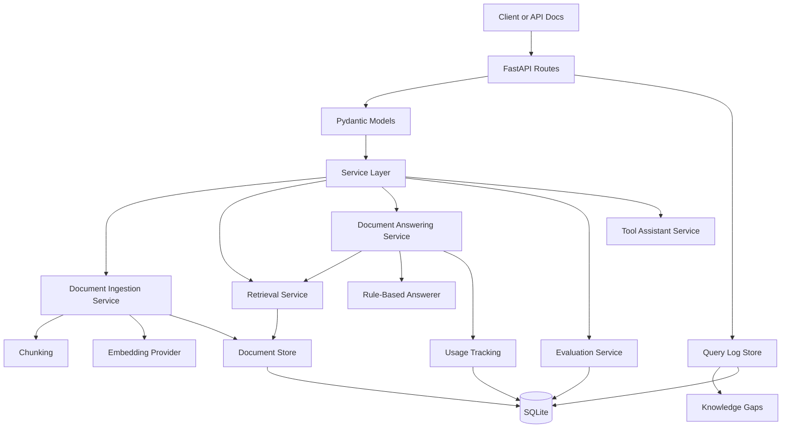

# LLM Extractor

A FastAPI backend for practical AI application patterns, centered on a business document RAG workflow.

The project supports structured extraction, classification, summarization, document upload, document ingestion, retrieval, grounded document Q&A with citations, explicit fallback behavior, query logging, knowledge-gap tracking, evaluation runs, usage tracking, and a simple tool-using assistant workflow.

This is a portfolio-oriented backend foundation for a Business RAG Knowledge-Base Chatbot. It is intentionally built with visible service boundaries rather than heavy framework magic, so the core AI engineering pieces are easy to inspect, test, and extend.

---

## Table of Contents

- [What This Project Demonstrates](#what-this-project-demonstrates)
- [Current Status](#current-status)
- [Features](#features)
- [Architecture Overview](#architecture-overview)
- [Project Structure](#project-structure)
- [Requirements](#requirements)
- [Quick Start](#quick-start)
- [Configuration](#configuration)
- [Running with Docker](#running-with-docker)
- [API Authentication](#api-authentication)
- [API Reference](#api-reference)
- [Document Q&A Workflow](#document-qa-workflow)
- [Admin and Debug Workflow](#admin-and-debug-workflow)
- [Tool Assistant Workflow](#tool-assistant-workflow)
- [Evaluation](#evaluation)
- [Usage and Cost Tracking](#usage-and-cost-tracking)
- [Testing](#testing)
- [Persistence](#persistence)
- [Operational Notes](#operational-notes)
- [Known Limitations](#known-limitations)
- [Suggested Roadmap](#suggested-roadmap)
- [Development Philosophy](#development-philosophy)

---

## What This Project Demonstrates

`llm-extractor` demonstrates core backend patterns used in real AI applications:

- FastAPI route design with Pydantic request and response models
- API-key protected admin endpoints
- structured extraction from text
- classification and summarization endpoints
- local deterministic substitutes for model behavior during development
- document upload for `.txt`, `.md`, and `.pdf`
- PDF text extraction with page-aware metadata
- document chunking
- local embedding generation with `sentence-transformers`
- hybrid vector and keyword retrieval
- grounded document answers with source citations
- explicit fallback behavior when retrieved context does not support an answer
- background ingestion jobs
- document listing, deletion, and re-indexing
- admin query logs with retrieved-source debug data
- knowledge-gap reporting from fallback questions
- document Q&A evaluation with answerable and unanswerable cases
- usage and estimated cost tracking
- SQLite-backed persistence
- request logging, request IDs, health checks, and Docker packaging

The current implementation is a strong backend slice. It is not yet a complete hosted web app.

---

## Current Status

Implemented:

- Backend API
- API-key protection for admin and document Q&A routes
- Text, Markdown, and PDF upload
- Background document ingestion jobs
- Document chunking and embedding
- SQLite document/chunk storage
- Page-aware PDF citations
- Hybrid retrieval
- Grounded document Q&A response
- Explicit `was_fallback` response field
- Document listing with metadata
- Document deletion
- Document re-indexing
- Query logs with retrieved sources
- Knowledge-gap endpoint for fallback questions
- 10-case document Q&A evaluation set
- Stored latest evaluation run
- Usage and estimated cost tracking
- Dockerfile for local containerized use

Not implemented yet:

- Frontend chat UI
- Admin dashboard UI
- Production vector database
- Postgres deployment
- Object storage for original uploaded files
- Real LLM provider answer synthesis
- Live hosted deployment
- Demo video

---

## Features

### Core Text Endpoints

- `POST /extract` — extracts structured fields from support text.
- `POST /classify` — classifies text into categories such as billing, technical, refund, or general.
- `POST /summarize` — returns a short summary from input text.
- `POST /answer` — answers a question from supplied context.
- `POST /route` — routes user input to a likely task type.
- `POST /chat` — returns a simple assistant reply.

### Document Q&A

- Upload `.txt`, `.md`, and `.pdf` documents.
- Create ingestion jobs and inspect job status.
- Process ingestion in FastAPI background tasks.
- Extract PDF text with page-aware citation metadata.
- Chunk documents into retrieval passages.
- Generate local embeddings with `sentence-transformers`.
- Store documents, chunks, page metadata, and embeddings in SQLite.
- Track document metadata:
  - document ID
  - filename
  - file type
  - upload date
  - indexing status
  - page count
  - chunk count
- Retrieve relevant chunks using hybrid vector and keyword scoring.
- Return grounded answers with:
  - answer text
  - explicit fallback flag
  - citation snippets
  - filenames
  - page numbers when available
  - vector, keyword, and hybrid scores
- Suppress answer citations when the system falls back because context does not support an answer.

### Admin and Debug

- List uploaded documents.
- Delete documents.
- Re-index documents.
- Inspect ingestion job status.
- View document query logs.
- Inspect retrieved chunks for each logged query.
- Track fallback questions through a knowledge-gap endpoint.
- Review latency, citation count, and fallback status for document Q&A calls.

### Tool Assistant

- Looks up order status.
- Checks refund eligibility.
- Creates pending refund requests.
- Requires confirmation before submitting a refund request.
- Records tool calls in the response.

### Evaluation and Observability

- Document Q&A evaluation script.
- 10-case document Q&A eval set.
- Answerable and unanswerable/fallback eval cases.
- Explicit fallback accuracy checks.
- Citation count and citation text checks.
- Retrieval score checks.
- Stored latest document Q&A evaluation run.
- Extraction evaluation script.
- Usage records for document embedding and document answering.
- Basic cost estimation.
- Request logging middleware with `X-Request-ID` support.
- Docker health check.

---

## Architecture Overview

```text
HTTP routes
  ↓
Pydantic request/response models
  ↓
Service layer
  ↓
Providers, tools, stores, and clients
  ↓
SQLite / local embeddings / external HTTP client where configured
```



Key design choices:

1. **Routes stay thin.**  
   FastAPI route handlers validate input, call services, translate application errors into HTTP errors, and return response models.

2. **Services contain application behavior.**  
   Extraction, classification, summarization, answering, ingestion, retrieval, tool use, evaluation, and usage tracking are separated into service modules.

3. **Local components keep development testable.**  
   The current system uses deterministic or local implementations for many model-like behaviors. This keeps tests predictable and avoids requiring paid model APIs during development.

4. **Document Q&A is grounded.**  
   Answers are generated only from retrieved document chunks. The API returns citations with source metadata and relevance scores.

5. **Fallback is explicit.**  
   Fallback is represented as `was_fallback`, not inferred from citation count.

6. **Admin visibility is backend-first.**  
   Query logs and knowledge gaps are exposed through APIs. A frontend dashboard is still a future step.

---

## Project Structure

```text
.
├── main.py                              # FastAPI app, route definitions, dependencies
├── auth.py                              # API key dependency
├── settings.py                          # Environment-based settings
├── Dockerfile                           # Container image definition
├── requirements.txt                     # Python dependencies
├── models/                              # Pydantic request/response models
├── services/                            # Application services and persistence
├── providers/                           # Embedding/model provider abstractions
├── clients/                             # External/local order API clients
├── tools/                               # Tool functions used by the assistant
├── evals/                               # Evaluation case definitions
├── scripts/                             # Evaluation runners
└── tests/                               # API, unit, and client tests
```

Important files:

| File | Purpose |
|---|---|
| `main.py` | FastAPI app, middleware, dependencies, and HTTP routes. |
| `auth.py` | Enforces `X-API-Key` authentication for protected endpoints. |
| `models/document_qa.py` | Document upload, Q&A, citation, query-log, and knowledge-gap response models. |
| `models/evaluation.py` | Document Q&A evaluation case and result models. |
| `services/pdf_parser.py` | Extracts readable text and page numbers from PDFs. |
| `services/document_ingestion_service.py` | Chunks uploaded documents, embeds chunks, stores documents, and records usage. |
| `services/document_ingestion_worker.py` | Manages ingestion job status transitions. |
| `services/ingestion_queue.py` | Defines the ingestion queue protocol and FastAPI background-task implementation. |
| `services/retrieval_service.py` | Performs hybrid vector and keyword retrieval. |
| `services/document_answering_service.py` | Retrieves chunks, answers questions, and returns citations. |
| `services/rule_based_answerer.py` | Local context-only answerer with fallback behavior. |
| `services/sqlite_document_store.py` | Persists documents, chunks, embeddings, and document metadata. |
| `services/document_query_log_store.py` | Persists document questions, answers, fallback status, and retrieved-source debug data. |
| `services/evaluation_result_store.py` | Persists document Q&A evaluation summaries and case results. |
| `services/usage_tracking_service.py` | Records estimated token usage and estimated cost. |
| `services/tool_assistant_service.py` | Implements order-status and refund-assistant workflow logic. |

---

## Requirements

- Python 3.12 recommended
- FastAPI
- Uvicorn
- Pydantic
- python-multipart
- pypdf
- sentence-transformers
- pytest
- httpx

The application uses `sentence-transformers/all-MiniLM-L6-v2` by default for local document embeddings. The first run may download the model.

---

## Quick Start

### 1. Clone the repository

```bash
git clone https://github.com/GiacomoMariani/llm-extractor.git
cd llm-extractor
```

### 2. Create and activate a virtual environment

```bash
python -m venv .venv
source .venv/bin/activate
```

On Windows PowerShell:

```powershell
python -m venv .venv
.\.venv\Scripts\Activate.ps1
```

### 3. Install dependencies

```bash
pip install --upgrade pip
pip install -r requirements.txt
```

### 4. Configure an API key

```bash
export APP_API_KEY="dev-secret-key"
```

On Windows PowerShell:

```powershell
$env:APP_API_KEY="dev-secret-key"
```

### 5. Run the API

```bash
uvicorn main:app --reload
```

The API will be available at:

```text
http://127.0.0.1:8000
```

Interactive API docs:

```text
http://127.0.0.1:8000/docs
```

Health check:

```bash
curl http://127.0.0.1:8000/health
```

Expected response:

```json
{
  "status": "ok"
}
```

---

## Configuration

Environment variables:

| Variable | Default | Purpose |
|---|---:|---|
| `APP_API_KEY` | none | Required for protected endpoints. Requests must send this value in `X-API-Key`. |
| `APP_DB_PATH` | `app.db` | SQLite database path for documents, chunks, ingestion jobs, query logs, evaluations, and usage records. |
| `APP_UPLOADED_TEXT_DB_PATH` | `uploaded_texts.db` | SQLite database path for staged uploaded text. |
| `APP_UPLOADED_TEXT_CLEANUP_MAX_AGE_HOURS` | `24` | Maximum age for uploaded text cleanup. |
| `EXTRACTOR_TYPE` | `rule` | Extraction backend. Supported values include local/mock implementations. |
| `ORDER_CLIENT_TYPE` | `local` | Order client backend. Supported values include `local`, `http`, and `http_with_fallback`. |
| `ORDER_API_BASE_URL` | none | Required when using an HTTP order client. |
| `ORDER_API_KEY` | none | Optional bearer token for the external order API client. |

Example local development configuration:

```bash
export APP_API_KEY="dev-secret-key"
export APP_DB_PATH="app.db"
export APP_UPLOADED_TEXT_DB_PATH="uploaded_texts.db"
export EXTRACTOR_TYPE="rule"
export ORDER_CLIENT_TYPE="local"
```

Example external order API configuration:

```bash
export APP_API_KEY="dev-secret-key"
export ORDER_CLIENT_TYPE="http_with_fallback"
export ORDER_API_BASE_URL="https://orders.example.com"
export ORDER_API_KEY="order-api-secret"
```

---

## Running with Docker

### Build the image

```bash
docker build -t llm-extractor .
```

### Run the container

```bash
docker run --rm \
  -p 8000:8000 \
  -e APP_API_KEY="dev-secret-key" \
  -e APP_DB_PATH="/app/data/app.db" \
  -e APP_UPLOADED_TEXT_DB_PATH="/app/data/uploaded_texts.db" \
  -v "$(pwd)/data:/app/data" \
  llm-extractor
```

Health check:

```bash
curl http://127.0.0.1:8000/health
```

Notes:

- The Dockerfile exposes port `8000`.
- The container includes a health check against `/health`.
- Mounting `/app/data` keeps SQLite files outside the disposable container filesystem.

---

## API Authentication

Protected endpoints require this header:

```http
X-API-Key: dev-secret-key
```

If `APP_API_KEY` is missing on the server, protected routes return `500` because the server is misconfigured.

If the request omits or sends the wrong key, protected routes return `401`.

---

## API Reference

### Health

```bash
curl http://127.0.0.1:8000/health
```

### Structured extraction

```bash
curl -X POST http://127.0.0.1:8000/extract \
  -H "Content-Type: application/json" \
  -H "X-API-Key: dev-secret-key" \
  -d '{
    "text": "Customer Jane Doe reports a billing issue with order ORD-123."
  }'
```

### Classification

```bash
curl -X POST http://127.0.0.1:8000/classify \
  -H "Content-Type: application/json" \
  -d '{
    "text": "I was charged twice for my subscription."
  }'
```

### Summarization

```bash
curl -X POST http://127.0.0.1:8000/summarize \
  -H "Content-Type: application/json" \
  -d '{
    "text": "The customer contacted support about a duplicate charge and requested a refund."
  }'
```

### Context answer

```bash
curl -X POST http://127.0.0.1:8000/answer \
  -H "Content-Type: application/json" \
  -H "X-API-Key: dev-secret-key" \
  -d '{
    "question": "What did the customer request?",
    "context": "The customer contacted support about a duplicate charge and requested a refund."
  }'
```

Response shape:

```json
{
  "answer": "The customer requested a refund.",
  "was_fallback": false
}
```

### Upload a document

Supported file types:

- `.txt`
- `.md`
- `.pdf`

```bash
curl -X POST http://127.0.0.1:8000/documents/upload \
  -H "X-API-Key: dev-secret-key" \
  -F "file=@docs/company-handbook.pdf"
```

Response shape:

```json
{
  "job_id": "job-abc123def456",
  "filename": "company-handbook.pdf",
  "status": "queued",
  "document_id": null,
  "chunk_count": null,
  "error_message": null,
  "created_at": "2026-05-05T08:00:00+00:00",
  "updated_at": "2026-05-05T08:00:00+00:00"
}
```

### Check ingestion job status

```bash
curl http://127.0.0.1:8000/documents/jobs/job-abc123def456 \
  -H "X-API-Key: dev-secret-key"
```

Response shape:

```json
{
  "job_id": "job-abc123def456",
  "filename": "company-handbook.pdf",
  "status": "completed",
  "document_id": "doc-abc123def456",
  "chunk_count": 8,
  "error_message": null,
  "created_at": "2026-05-05T08:00:00+00:00",
  "updated_at": "2026-05-05T08:00:02+00:00"
}
```

Possible statuses:

- `queued`
- `processing`
- `completed`
- `failed`

### List documents

```bash
curl http://127.0.0.1:8000/documents \
  -H "X-API-Key: dev-secret-key"
```

Response shape:

```json
{
  "documents": [
    {
      "document_id": "doc-abc123def456",
      "filename": "company-handbook.pdf",
      "file_type": "pdf",
      "upload_date": "2026-05-05T08:00:02+00:00",
      "status": "indexed",
      "page_count": 12,
      "chunk_count": 8
    }
  ]
}
```

### Ask a document question

```bash
curl -X POST http://127.0.0.1:8000/documents/ask \
  -H "Content-Type: application/json" \
  -H "X-API-Key: dev-secret-key" \
  -d '{
    "document_id": "doc-abc123def456",
    "question": "What is the vacation policy?",
    "top_k": 3
  }'
```

Response shape:

```json
{
  "answer": "Employees receive 20 vacation days per year.",
  "citations": [
    {
      "chunk_id": "doc-abc123def456-chunk-2",
      "filename": "company-handbook.pdf",
      "page_number": 4,
      "snippet": "Employees receive 20 vacation days per year.",
      "vector_score": 0.82,
      "keyword_score": 1.0,
      "hybrid_score": 0.91
    }
  ],
  "was_fallback": false
}
```

Fallback response shape:

```json
{
  "answer": "I could not find the answer in the provided context.",
  "citations": [],
  "was_fallback": true
}
```

### Re-index a document

```bash
curl -X POST http://127.0.0.1:8000/documents/doc-abc123def456/reindex \
  -H "X-API-Key: dev-secret-key"
```

Response shape:

```json
{
  "job_id": "job-def456abc123",
  "document_id": "doc-abc123def456",
  "filename": "company-handbook.pdf",
  "status": "queued"
}
```

### Delete a document

```bash
curl -X DELETE http://127.0.0.1:8000/documents/doc-abc123def456 \
  -H "X-API-Key: dev-secret-key"
```

Response shape:

```json
{
  "document_id": "doc-abc123def456",
  "deleted": true
}
```

### View document query logs

```bash
curl "http://127.0.0.1:8000/admin/document-query-logs?limit=10" \
  -H "X-API-Key: dev-secret-key"
```

Response shape:

```json
{
  "logs": [
    {
      "query_id": "query-abc123def456",
      "document_id": "doc-abc123def456",
      "question": "What is the vacation policy?",
      "answer": "Employees receive 20 vacation days per year.",
      "citation_count": 1,
      "latency_ms": 18.5,
      "was_fallback": false,
      "created_at": "2026-05-05T08:05:00+00:00",
      "retrieved_sources": [
        {
          "source_id": "source-abc123def456",
          "query_id": "query-abc123def456",
          "chunk_id": "doc-abc123def456-chunk-2",
          "filename": "company-handbook.pdf",
          "snippet": "Employees receive 20 vacation days per year.",
          "page_number": 4,
          "vector_score": 0.82,
          "keyword_score": 1.0,
          "hybrid_score": 0.91
        }
      ]
    }
  ]
}
```

### View knowledge gaps

Knowledge gaps are fallback document questions. They help identify missing information in the uploaded documents.

```bash
curl "http://127.0.0.1:8000/admin/knowledge-gaps?limit=10" \
  -H "X-API-Key: dev-secret-key"
```

Response shape:

```json
{
  "gaps": [
    {
      "query_id": "query-def456abc123",
      "document_id": "doc-abc123def456",
      "question": "What is the refund policy?",
      "answer": "I could not find the answer in the provided context.",
      "citation_count": 0,
      "latency_ms": 14.2,
      "created_at": "2026-05-05T08:10:00+00:00"
    }
  ]
}
```

### Latest document Q&A evaluation run

```bash
curl http://127.0.0.1:8000/evals/document-qa/latest \
  -H "X-API-Key: dev-secret-key"
```

Response shape:

```json
{
  "run_id": "eval-abc123def456",
  "total_cases": 10,
  "passed": 10,
  "failed": 0,
  "average_latency_ms": 12.34,
  "created_at": "2026-05-05T08:00:00+00:00",
  "results": [
    {
      "name": "backend_framework_question",
      "passed": true,
      "answer": "FastAPI is the backend framework used in this project.",
      "was_fallback": false,
      "citation_count": 1,
      "checks": [
        "Answer contains 'FastAPI'."
      ],
      "failures": [],
      "latency_ms": 10.0,
      "document_id": "doc-abc123def456"
    }
  ]
}
```

### Usage summary

```bash
curl http://127.0.0.1:8000/usage/summary \
  -H "X-API-Key: dev-secret-key"
```

Response shape:

```json
{
  "total_estimated_cost_usd": 0.0,
  "recent_record_count": 2
}
```

### Recent usage records

```bash
curl "http://127.0.0.1:8000/usage/recent?limit=10" \
  -H "X-API-Key: dev-secret-key"
```

---

## Document Q&A Workflow

Typical backend flow:

1. Upload a `.txt`, `.md`, or `.pdf` file through `POST /documents/upload`.
2. The API stores the uploaded text in a staging table.
3. The API creates an ingestion job.
4. A background task processes the document.
5. The ingestion service chunks the document.
6. The embedding provider generates one embedding per chunk.
7. The document store persists:
   - document metadata
   - original extracted text
   - chunk text
   - chunk embeddings
   - page numbers when available
8. The user asks a question through `POST /documents/ask`.
9. The retrieval service retrieves top candidate chunks.
10. The answerer returns either:
    - a grounded answer with citations, or
    - a fallback response if the context does not support an answer.
11. The API logs the question, answer, latency, citation count, fallback status, and retrieved sources.

---

## Admin and Debug Workflow

The backend exposes admin/debug data through API routes.

Useful admin calls:

```bash
curl http://127.0.0.1:8000/documents \
  -H "X-API-Key: dev-secret-key"
```

```bash
curl "http://127.0.0.1:8000/admin/document-query-logs?limit=20" \
  -H "X-API-Key: dev-secret-key"
```

```bash
curl "http://127.0.0.1:8000/admin/knowledge-gaps?limit=20" \
  -H "X-API-Key: dev-secret-key"
```

This supports a future admin dashboard with:

- document library
- ingestion status
- document actions
- query logs
- retrieval debug view
- fallback/knowledge-gap review

---

## Tool Assistant Workflow

The tool assistant demonstrates a separate AI product pattern: assistant-controlled tool use with confirmation before side effects.

### Ask about order status

```bash
curl -X POST http://127.0.0.1:8000/tool-assistant \
  -H "Content-Type: application/json" \
  -H "X-API-Key: dev-secret-key" \
  -d '{
    "message": "Where is order ORD-123?"
  }'
```

### Ask about refund eligibility

```bash
curl -X POST http://127.0.0.1:8000/tool-assistant \
  -H "Content-Type: application/json" \
  -H "X-API-Key: dev-secret-key" \
  -d '{
    "message": "Can I get a refund for ORD-789?"
  }'
```

### Create a pending refund request

```bash
curl -X POST http://127.0.0.1:8000/tool-assistant \
  -H "Content-Type: application/json" \
  -H "X-API-Key: dev-secret-key" \
  -d '{
    "message": "I want to request a refund for ORD-123."
  }'
```

### Confirm a pending action

```bash
curl -X POST http://127.0.0.1:8000/tool-assistant \
  -H "Content-Type: application/json" \
  -H "X-API-Key: dev-secret-key" \
  -d '{
    "message": "Confirm PEND-001."
  }'
```

This two-step pattern is intentional: the assistant can prepare an action, but the user must explicitly confirm before the side effect is completed.

---

## Evaluation

The repository includes evaluation cases and scripts for two capabilities.

### Extraction evaluation

```bash
python scripts/run_extraction_eval.py
```

This loads cases from:

```text
evals/extraction_cases.json
```

It compares actual structured extraction output against expected JSON.

### Document Q&A evaluation

```bash
python scripts/run_document_qa_eval.py
```

This loads cases from:

```text
evals/document_qa_cases.json
```

The document Q&A evaluation checks:

- answer content
- fallback behavior
- citation count
- citation content
- retrieval score presence
- latency per case

The current document Q&A eval set includes 10 cases, with both answerable and unanswerable/fallback questions.

It stores the latest evaluation run in SQLite so it can be inspected through:

```bash
curl http://127.0.0.1:8000/evals/document-qa/latest \
  -H "X-API-Key: dev-secret-key"
```

---

## Usage and Cost Tracking

The app records usage for document embedding and document answering operations.

Usage records include:

- operation name
- provider
- model name
- estimated input tokens
- estimated output tokens
- estimated cost
- metadata
- creation timestamp

The token estimator is intentionally simple: approximately one token per four characters. Default pricing is zero unless a service records usage with explicit pricing.

### Usage summary

```bash
curl http://127.0.0.1:8000/usage/summary \
  -H "X-API-Key: dev-secret-key"
```

### Recent usage records

```bash
curl "http://127.0.0.1:8000/usage/recent?limit=10" \
  -H "X-API-Key: dev-secret-key"
```

---

## Testing

Run the full test suite:

```bash
pytest -q
```

Useful focused test commands:

```bash
pytest tests/api/test_document_routes.py
```

```bash
pytest tests/units/test_document_answering_service.py
```

```bash
pytest tests/units/test_document_query_log_store.py
```

```bash
pytest tests/units/test_document_store_metadata.py
```

```bash
pytest tests/units/test_document_qa_evaluation_service.py
```

```bash
pytest tests/units/test_evaluation_result_store.py
```

The tests cover:

- API routes
- service behavior
- document ingestion
- PDF parsing
- ingestion queues
- stored text ingestion
- retrieval scoring
- document answering
- explicit fallback behavior
- document query logs
- knowledge gaps
- document metadata
- evaluation result storage
- usage tracking
- tool assistant behavior
- order client fallback and retry behavior

For local app testing, remember to configure:

```bash
export APP_API_KEY="dev-secret-key"
```

The test suite itself sets a test API key through fixtures.

---

## Persistence

The app uses SQLite.

By default, persistent application data is written to:

```text
app.db
```

The upload staging store defaults to:

```text
uploaded_texts.db
```

Tables include data for:

- documents
- chunks
- ingestion jobs
- staged uploaded text
- document query logs
- retrieved source logs
- evaluation runs
- evaluation case results
- usage records

Set `APP_DB_PATH` to control the main application database location:

```bash
export APP_DB_PATH="data/app.db"
```

Set `APP_UPLOADED_TEXT_DB_PATH` to control the upload staging database location:

```bash
export APP_UPLOADED_TEXT_DB_PATH="data/uploaded_texts.db"
```

For Docker, prefer mounting a volume and setting SQLite paths inside that volume.

---

## Operational Notes

### Request logging

Every request is logged with:

- method
- path
- status code
- duration in milliseconds
- request ID

If a request sends `X-Request-ID`, the app reuses it. Otherwise, the middleware creates a short request ID and returns it in the response header.

### Background jobs

Document uploads create ingestion jobs and enqueue work through the `DocumentIngestionQueue` protocol.

The current implementation uses FastAPI `BackgroundTasks`. This is useful for learning and small local deployments, but it is not a durable queue. If the process exits before the background task completes, queued work can be lost.

### Uploaded text staging

Document upload stores raw extracted text in a staging table and queues a pointer to that stored text. This avoids putting large raw text directly into the queue payload.

Completed ingestion deletes the staged text. Failed or abandoned staging records can be cleaned up through the uploaded-text cleanup endpoint.

### Fallback logging

Fallback is stored explicitly as `was_fallback`.

This matters because fallback should not be inferred only from citation count. A fallback event is a product-quality signal: it tells the admin that the knowledge base may be missing information.

### External order API mode

The order tools can use:

- a local fixture client
- an HTTP order client
- an HTTP client with local fallback

The HTTP client handles:

- `404` as order not found
- retryable status codes such as `429`, `500`, `502`, `503`, and `504`
- `Retry-After` for rate limits when provided
- fallback to local fixtures when configured as `http_with_fallback`

---

## Known Limitations

This project is intentionally practical but not fully production-ready.

Current limitations:

1. **No frontend yet.**  
   The project currently exposes backend APIs only. A visitor-facing chat UI and admin dashboard are still future work.

2. **The queue is not durable.**  
   FastAPI background tasks are not a replacement for Redis, RQ, Celery, SQS, or another durable queue.

3. **The main answerer is rule-based.**  
   It selects relevant sentences from retrieved context. It does not yet call a real LLM for natural-language synthesis.

4. **SQLite is local-first.**  
   SQLite is excellent for learning and small deployments, but multi-instance production deployments usually require a managed database.

5. **Embeddings are stored in SQLite.**  
   This is acceptable for a small local MVP, but a production RAG system should use a dedicated vector database or Postgres with pgvector.

6. **Original uploaded files are not stored in object storage.**  
   The system stores extracted/staged text and document/chunk data. S3 or Supabase Storage would be better for production uploaded-file management.

7. **Authentication is basic.**  
   API-key auth is useful for development but does not provide user identity, roles, scopes, or tenant isolation.

8. **Cost tracking is approximate.**  
   Token counts are estimated by character length and default pricing is zero.

9. **Monitoring is basic.**  
   Logs and health checks exist, but metrics, traces, dashboards, and alerting are not yet implemented.

10. **No deployed live app yet.**  
    The app can run locally or in Docker, but there is no hosted production deployment included.

---

## Development Philosophy

This project favors boring, inspectable reliability over framework-heavy abstraction.

Good AI application engineering is mostly careful software engineering around uncertain model behavior:

- validate inputs
- constrain outputs
- isolate side effects
- track jobs
- return citations
- log retrieved context
- expose fallback events
- measure quality
- estimate cost
- keep clear service boundaries

That makes the codebase useful for practicing production AI engineering rather than just demonstrating a local prototype.